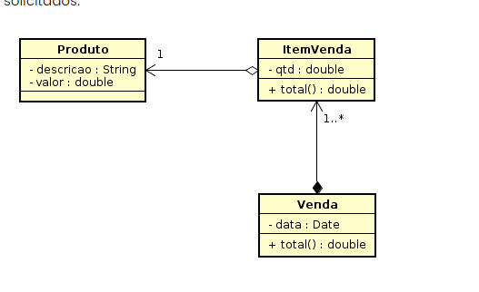

# MapeamentoComAssociacoesJPA

Com JPA você aprendeu que podemos gerar nossas tabelas no banco de dados usando anotações. Deste modo, crie um novo projeto e crie entidades conforme diagrama de classe a seguir.

Você deve definir os relacionamento das associações entre as classes usando as anotações JPA conforme instruções do material em https://fagno.github.io/pwebii-spring-ifto/jpa/#_mapeamento_com_associa%C3%A7%C3%B5es.

Você deve inserir os dados do(s) produto(s) e venda(s) diretamente no banco.

Não é necessário criar a interface web completa do projeto, você deve apenas criar o list.html de Venda e apresentar os seguintes dados (ID, DATA E TOTAL) da(s) venda(s). Crie o Repository e Controller de Venda para apresentar os dados solicitados.

